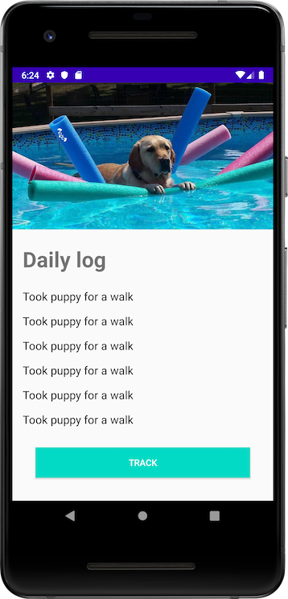

## Puppy Tracker

This is a sample application created to demonstrate the basics of Android development using
the Kotlin programming language.

It makes use of the following libraries:

* Android KTX Extensions
* Coil *(Image loading)*
* Retrofit *(Networking)*
* Moshi *(JSON parsing)*

### App Screenshot

